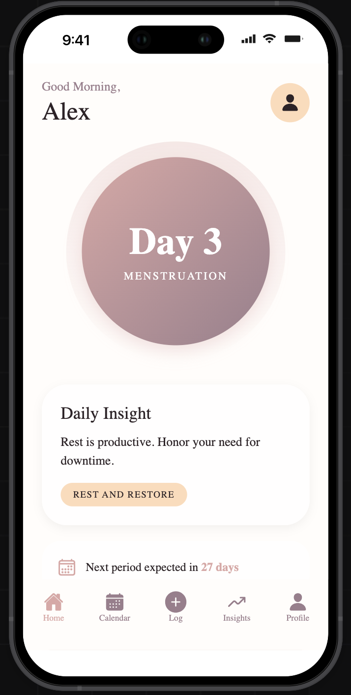
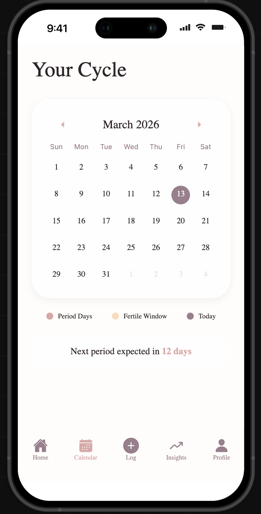
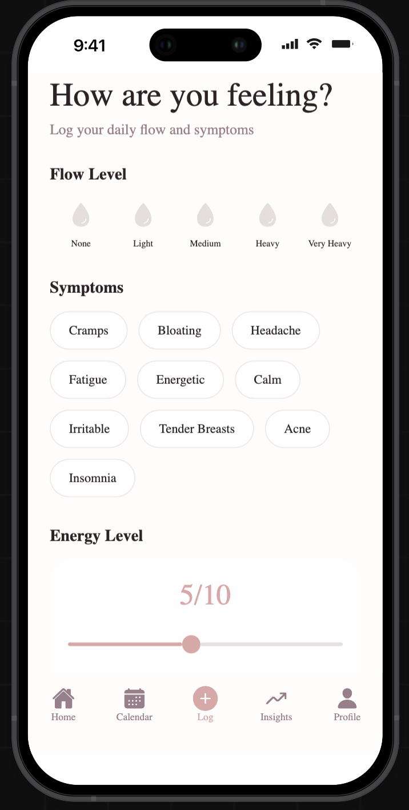
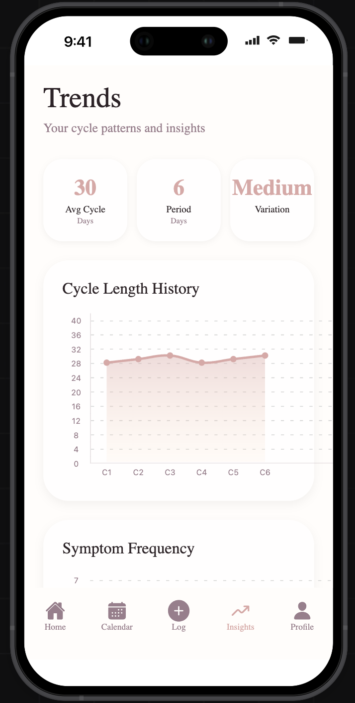

# Soma

Cycle tracking app built with Expo + React Native + Supabase, with a companion Next.js website.

GitHub repo description:
Privacy-first cycle tracking app (Expo + React Native + Supabase) with partner sync, daily logs, and web download.

## What is implemented

### Mobile app

- Authentication: email login/signup + anonymous session flow
- Onboarding: welcome + setup flow for initial profile/cycle start
- Core tabs: Home, Calendar, Insights, Profile/Settings
- Logging: period range modal, daily flow/symptom/notes logging, quick check-in
- Partner sync: code-based linking and permission toggles
- Notifications: daily reminder scheduling and permission handling
- Data controls: export (JSON/CSV) and delete account data
- Analytics/error hooks integrated in key flows

### Website (`web/`)

- Marketing pages: Home, Features, Download, Privacy, Terms, Support
- Download links point to GitHub latest release asset:
  `https://github.com/848deepak/Soma-/releases/latest/download/soma.apk`

## Screenshots

| App | App |
| --- | --- |
|  |  |
|  |  |

## Tech stack

- Expo SDK 55, React Native 0.83, Expo Router
- TanStack Query + Supabase
- NativeWind + Reanimated
- Jest + Testing Library
- Next.js 16 (website)

## Project structure

```text
app/                Expo Router routes (mobile)
src/                App screens/components/services/hooks
hooks/              Shared hooks
lib/                Auth + Supabase client
supabase/           SQL schema + RLS policies
web/                Next.js marketing/download website
__tests__/          Unit/component/integration tests
```

## Local development

### Prerequisites

- Node.js 20+
- npm
- Expo CLI / EAS CLI (for cloud builds)

### Install

```bash
npm install
cd web && npm install && cd ..
```

### Run mobile app

```bash
npm run start
```

### Run website

```bash
cd web
npm run dev
```

## Environment

Create local env file from example:

```bash
cp .env.example .env.local
```

Required public vars:

- `EXPO_PUBLIC_SUPABASE_URL`
- `EXPO_PUBLIC_SUPABASE_ANON_KEY`

For EAS cloud builds, prefer project secrets:

```bash
eas secret:create --scope project --name EXPO_PUBLIC_SUPABASE_URL --value "https://YOUR_PROJECT_REF.supabase.co"
eas secret:create --scope project --name EXPO_PUBLIC_SUPABASE_ANON_KEY --value "YOUR_SUPABASE_ANON_KEY"
```

## Quality checks

```bash
npm run typecheck
npm test
cd web && npm run build
```

## Build and release

Expo project:

- https://expo.dev/accounts/848deepak/projects/soma-health

### EAS builds

Android preview APK:

```bash
eas build --platform android --profile preview
```

Android production AAB:

```bash
eas build --platform android --profile production
```

iOS production build:

```bash
eas build --platform ios --profile production
```

### Website + download behavior

The website download buttons use GitHub Releases `latest/download/soma.apk`, so keeping the release asset updated is enough.

Upload/replace APK on release:

```bash
gh release upload v1.0.0 android/app/build/outputs/apk/debug/app-debug.apk#soma.apk --clobber
```

## Notes

- This README intentionally reflects implemented functionality only.
- If features change, update both website copy and this README together.
